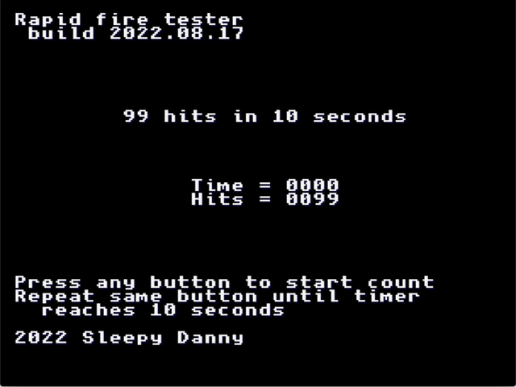

# ngrapidfire-tester
This is a simple homebrew app for Neo Geo AES / MVS. Have a controller with
turbo buttons and wondering how fast they fire? Or you just want to know fast
you can smash those buttons? Give this a try!

## Building from source
### Prerequisites
You need to have [ngdevkit](ngdevkit) installed. Please follow instructions
from ngdevkit first.

### Compiling
#### macOS
This project is build upon [ngdevkit-examples](ngdevkit-examples). Make sure
to use [brew](brew)'s python3 and gmake

    cd examples
    export PATH=/usr/local/opt/python3/bin:$PATH
    autoreconf -iv
    ./configure
    gmake

The same procedure should work on Linux too but not tested at the moment.

### Running
Compiled ROMs are placed under `rapidfire-tester/rom`. You can run the program
by using the gngeo emulator provisioned by ngdevkit.

    gmake -C rapidfire-tester gngeo

Alternatively, you can also copy the ROM zip file and run it under MAME. The
zip file `rapidfire-tester/rom/puzzledp.zip` is recognized by MAME as
Puzzle De Pon. Place it under MAME's rom directory (backup the original if you
have one) and simply launch MAME with it.

If you have have a Neo Geo flash cart such as Darksoft or NeoSD, this may also
work on actual Neo Geo hardware. The ROM files may need conversions to work with
specific flash carts. Contact the flash cart vendor on how to convert MAME ROMs
for use on your flash cart.

## Usage
After the program launches, press any button (except START or SELECT) to start
the timer. Hits to the same button will be counted while the timer counts to
10 seconds, and all other buttons are ignored. At the end of 10 seconds, the
total button hits will be displayed.

## Notes
- This program was only tested on an Neo Geo AES (NTSC Japan factory BIOS)
- START and SELECT buttons not supported at the moment
- Anything faster than 30 hits per second will not count correctly
- Mahjong controller is not supported

## Acknowledgement
This project builds off the structure provided by
[ngdevkit-examples](ngdevkit-examples) and may contain assets from it. Great
thanks to the team behind [ngdevkit](ngdevkit).

## License
This program is free software: you can redistribute it and/or modify
it under the terms of the GNU Lesser General Public License as
published by the Free Software Foundation, either version 3 of the
License, or (at your option) any later version.

This program is distributed in the hope that it will be useful, but
WITHOUT ANY WARRANTY; without even the implied warranty of
MERCHANTABILITY or FITNESS FOR A PARTICULAR PURPOSE. See the GNU
Lesser General Public License for more details.

You should have received a copy of the GNU Lesser General Public
License along with this program. If not, see
<http://www.gnu.org/licenses/>.

[ngdevkit]: https://github.com/dciabrin/ngdevkit
[ngdevkit-examples]: https://github.com/dciabrin/ngdevkit-examples
[brew]: https://brew.sh
